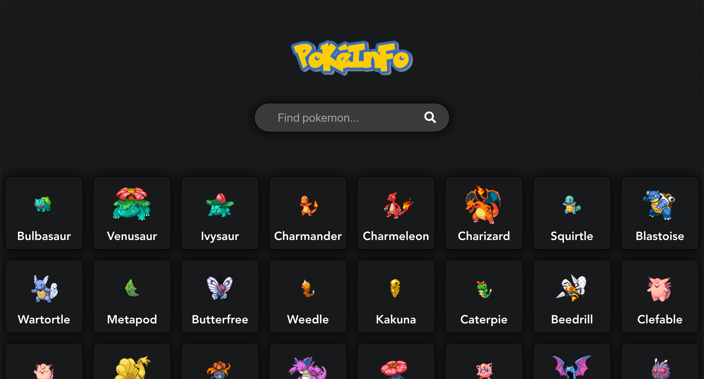
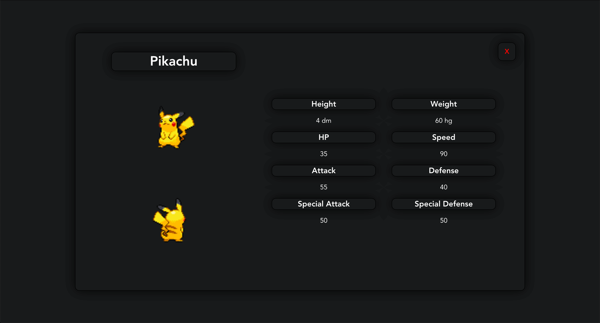

# PokeInfo



In PokeInfo you can search for 151 pokemons.
After search you will get some basic information like this:



## Project setup

```
npm install
```

### Compiles and hot-reloads for development

```
npm run serve
```

This app is powered by PokeApi https://pokeapi.co/ .
